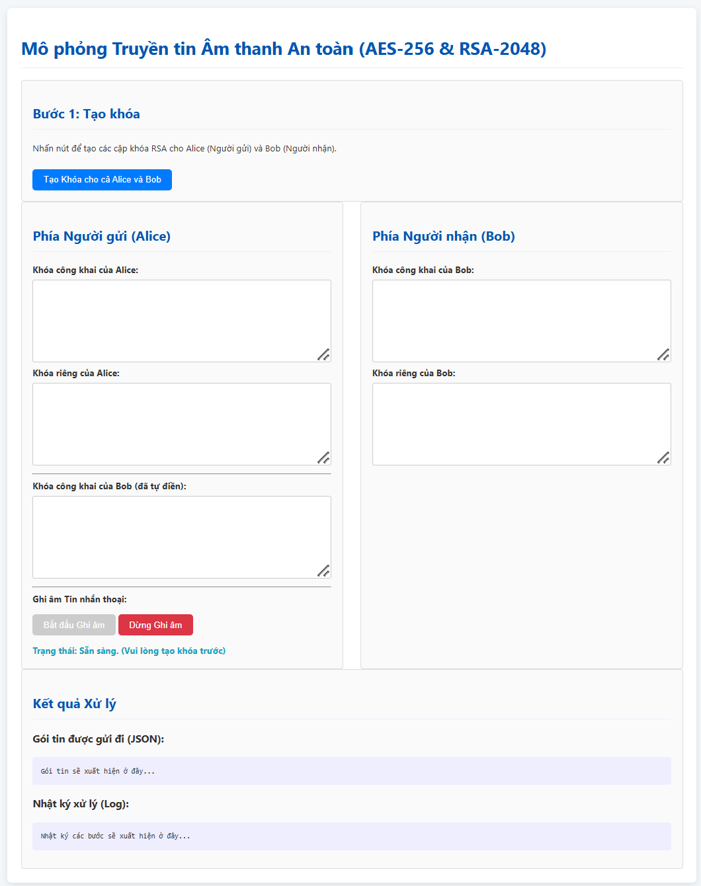

# Mô phỏng Truyền tin Âm thanh An toàn (AES-256 & RSA-2048)

Đây là một ứng dụng web được xây dựng bằng Python và Flask, chạy hoàn toàn trên Google Colab, nhằm mô phỏng quá trình truyền và nhận một tin nhắn âm thanh an toàn. Ứng dụng minh họa các khái niệm cốt lõi của mật mã học hiện đại như mã hóa lai, chữ ký số và tính toàn vẹn dữ liệu.

[]()
[]()
[]()
[](https://opensource.org/licenses/MIT)

## Giao diện ứng dụng



---

## ✨ Tính năng chính

-   **Tạo cặp khóa RSA:** Tự động tạo cặp khóa Công khai/Bí mật (2048-bit) cho người gửi (Alice) và người nhận (Bob).
-   **Ghi âm trực tiếp:** Sử dụng Web API của trình duyệt để ghi âm tin nhắn thoại trực tiếp.
-   **Mã hóa lai (Hybrid Encryption):**
    -   Sử dụng **AES-256** (mã hóa đối xứng) để mã hóa nội dung âm thanh (nhanh và hiệu quả cho dữ liệu lớn).
    -   Sử dụng **RSA-2048** (mã hóa bất đối xứng) để mã hóa khóa phiên AES một cách an toàn.
-   **Chữ ký số & Toàn vẹn dữ liệu:**
    -   Tạo **Hash SHA-256** của bản mã để đảm bảo tính toàn vẹn.
    -   Tạo **Chữ ký số RSA-PSS** bằng khóa bí mật của người gửi để xác thực và chống chối bỏ.
-   **Mô phỏng chi tiết:** Hiển thị từng bước của quá trình mã hóa và giải mã trong một nhật ký (log) dễ hiểu.
-   **Tải xuống kết quả:** Cho phép tải xuống một file `.zip` chứa gói tin JSON đã gửi và file âm thanh đã được giải mã thành công.

---

## 🛠️ Công nghệ sử dụng

-   **Backend:**
    -   **Python 3**
    -   **Flask:** Để tạo máy chủ web và các API endpoint.
    -   **Cryptography:** Thư viện Python mạnh mẽ cho các tác vụ mã hóa.
-   **Frontend:**
    -   HTML5, CSS3, JavaScript (Vanilla JS).
    -   **Web Audio API (`MediaRecorder`):** Để ghi âm trong trình duyệt.
-   **Tunneling & Deployment:**
    -   **Ngrok:** Để tạo một đường hầm (tunnel) công khai tới server Flask đang chạy trên môi trường Colab.
    -   **Google Colab:** Môi trường để chạy toàn bộ ứng dụng mà không cần cài đặt локально.

---

## 🚀 Cách chạy trên Google Colab

Dự án này được thiết kế để chạy trong một ô mã duy nhất trên Google Colab.

[](https://colab.research.google.com/github/TEN_GITHUB_CUA_BAN/TEN_REPO_CUA_BAN/blob/main/Ten_File_Notebook.ipynb)

*(Lưu ý: Thay thế link trên bằng link đến file Notebook của bạn trên GitHub)*

1.  **Lấy token xác thực của Ngrok:**
    -   Đăng ký/đăng nhập vào [Ngrok Dashboard](https://dashboard.ngrok.com/get-started/your-authtoken).
    -   Sao chép token xác thực (authtoken) của bạn.

2.  **Mở file Notebook trên Colab:**
    -   Nhấn vào nút "Open in Colab" ở trên hoặc mở trực tiếp file `.ipynb` trong Colab.

3.  **Cập nhật Ngrok Authtoken:**
    -   Tìm đến dòng sau trong ô mã:
      ```python
      !ngrok authtoken YOUR_TOKEN_HERE
      ```
    -   Thay thế `YOUR_TOKEN_HERE` bằng token bạn đã sao chép ở bước 1.

4.  **Chạy ứng dụng:**
    -   Nhấn nút "Run" (▶️) để chạy toàn bộ ô mã.
    -   Chờ quá trình cài đặt và khởi tạo hoàn tất.

5.  **Truy cập ứng dụng:**
    -   Ở cuối phần output, bạn sẽ thấy một dòng chữ: `🌍 Ứng dụng của bạn đang chạy tại URL công khai: http://....ngrok-free.app`.
    -   Nhấn vào URL đó để mở ứng dụng trong một tab mới và bắt đầu sử dụng.

---

## 🔐 Luồng hoạt động bảo mật

Ứng dụng mô phỏng chính xác các bước của một giao thức truyền tin an toàn:

1.  **Khởi tạo:** Alice và Bob tạo cặp khóa RSA riêng. Họ trao đổi khóa công khai cho nhau.
2.  **Phía Alice (Gửi tin):**
    -   Alice tạo một **khóa phiên AES** ngẫu nhiên, chỉ dùng một lần.
    -   Cô dùng khóa AES này để mã hóa tin nhắn âm thanh.
    -   Cô dùng **khóa công khai của Bob** để mã hóa khóa phiên AES.
    -   Cô tạo **hash (SHA-256)** của tin nhắn đã mã hóa để kiểm tra tính toàn vẹn.
    -   Cuối cùng, cô dùng **khóa bí mật của mình** để ký lên hash, tạo ra một chữ ký số.
    -   Toàn bộ (bản mã, khóa AES đã mã hóa, IV, chữ ký) được đóng gói và gửi đi.
3.  **Phía Bob (Nhận tin):**
    -   Bob dùng **khóa bí mật của mình** để giải mã và lấy lại khóa phiên AES.
    -   Bob tính toán lại hash từ bản mã nhận được.
    -   Bob dùng **khóa công khai của Alice** để xác thực chữ ký. Nếu chữ ký hợp lệ và hash khớp nhau, tin nhắn được xác nhận là từ Alice và không bị thay đổi.
    -   Bob dùng khóa phiên AES đã giải mã để giải mã tin nhắn âm thanh và nghe nội dung.

---

## PHAN VĂN ĐẰNG - CNTT17-07 - TRƯỜNG ĐẠI HỌC ĐẠI NAM
